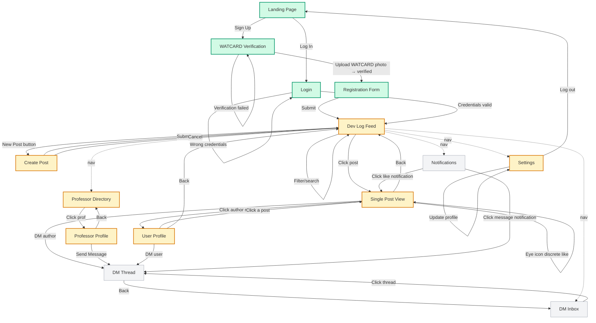

# Frontend Architecture and Page Spec

**For:** Reanna and coding agents building the React + Tailwind frontend
**Backend base URL:** `http://localhost:8000`
**Auth pattern:** JWT stored in localStorage, sent as `Authorization: Bearer <token>` on every request

---

## User Flow Diagram



**Legend:** Green = built, Yellow = building now, Gray = not started

---

## Global Layout

Every authenticated page shares a persistent nav bar and layout wrapper.

**Nav Bar component** (fixed top, present on all authenticated pages):
Left: Logo/app name (links to /feed)
Center: Feed | Professors | Messages
Right: Notification bell (with red unread dot) | Profile avatar dropdown (Profile, Settings, Log out)

**Layout:** max-w-5xl mx-auto, content below nav bar with pt-16 to clear fixed header.

**Auth guard:** If no JWT in localStorage, redirect to `/`. If JWT exists but user `is_verified` is false, redirect to `/verify`.

---

## Page by Page Specification

### 1. Landing Page

| Field | Value |
|---|---|
| Route | `/` |
| Auth required | No |
| API calls | None |
| Purpose | Marketing page, directs to signup or login |

**Components:** Hero section with one-liner ("Where UW engineers share what they're building"), two CTA buttons: "Sign Up" (links to /verify) and "Log In" (links to /login). Keep it minimal. No feature carousel, no testimonials. One screen, two buttons.

**Behavior:** If user is already logged in (JWT exists and valid), redirect to `/feed`.

---

### 2. Login

| Field | Value |
|---|---|
| Route | `/login` |
| Auth required | No |
| API calls | `POST /api/auth/login` |

**Components:** Email input, password input, submit button, link to "Sign up instead."

**Request:**
```json
{ "email": "user@uwaterloo.ca", "password": "..." }
```

**Response (200):**
```json
{
  "access_token": "jwt...",
  "token_type": "bearer",
  "user": { "id": "...", "name": "...", "email": "...", "department": "...", "year": "...", "bio": "...", "profile_picture": "...", "is_verified": true, "is_professor": false, "created_at": "..." }
}
```

**On success:** Store `access_token` in localStorage, store `user` in React context/state, redirect to `/feed`.
**On 401:** Show "Invalid email or password."

---

### 3. WATCARD Verification

| Field | Value |
|---|---|
| Route | `/verify` |
| Auth required | No (this is step 1 of signup) |
| API calls | `POST /api/auth/verify-watcard` |

**Components:** Heading "Verify your Engineering status", file upload area (drag and drop or click to upload), preview of uploaded image, submit button, status message.

**Request:** multipart/form-data with `file` field containing the WATCARD image.

**Response (200):**
```json
{ "is_engineering": true, "confidence": 0.95, "extracted_text": "..." }
```

**On success (is_engineering=true):** Store verification status in local state, redirect to `/register`.
**On failure (is_engineering=false):** Show "We couldn't verify your Engineering status. Please try again with a clearer photo." Let them re-upload.

---

### 4. Registration

| Field | Value |
|---|---|
| Route | `/register` |
| Auth required | No (but must have passed WATCARD verification) |
| API calls | `POST /api/auth/signup` |

**Guard:** If user hasn't completed WATCARD verification (no verification state), redirect to `/verify`.

**Components:** Form with: email input (@uwaterloo.ca, validated client-side), password input (min 6 chars), name input, department dropdown (list of UW engineering departments), year dropdown (1, 2, 3, 4, 5, grad), submit button.

**Department options:**
"Biomedical Engineering",
"Chemical Engineering",
"Civil and Environmental Engineering",
"Electrical and Computer Engineering",
"Management Engineering",
"Mechanical and Mechatronics Engineering",
"Nanotechnology Engineering",
"Software Engineering",
"Systems Design Engineering",
"Architecture"

**Request:**
```json
{ "email": "e2zou@uwaterloo.ca", "password": "...", "name": "Eric Zou", "department": "Electrical and Computer Engineering", "year": "3" }
```

**Response (200):** Same as login response (TokenResponse with user object).
**On success:** Store token and user, redirect to `/feed`.
**On 409:** Show "An account with this email already exists."

---

### 5. Dev Log Feed (Main Screen)

| Field | Value |
|---|---|
| Route | `/feed` |
| Auth required | Yes |
| API calls | `GET /api/posts` |

**This is the core page. Twitter-style timeline.**

**Components:**
Top bar: "New Post" button (links to /post/new), search input, filter dropdowns/chips.
Main area: Scrollable list of post cards, single column, max-w-2xl centered.
Each post card shows: author avatar + name + department/year (clickable, links to /profile/:id), post title (bold), body text (truncated to ~200 chars with "show more"), tag pills (project_stage, category, tech_stack items, field items), media thumbnails (if any, max 3), time ago, eye icon (like button).

**Filter controls** (top bar or sidebar):
`stage` dropdown: All, Idea, Early Prototype, Working Prototype, Polished, Shipped
`category` dropdown: All, Hardware, Software, Both
`field` multi-select chips: sustainability, ai_ml, healthcare, robotics, fintech, embedded, web, mobile, data, security, other
`tech` text input: freeform search within tech_stack
`search` text input: full text search on title and body

**Request:**
```
GET /api/posts?page=1&page_size=20&stage=early_prototype&category=hardware&field=robotics&tech=arduino&search=motor
```

**Response (200):**
```json
{
  "posts": [
    {
      "id": "uuid",
      "author": { "id": "...", "name": "...", "email": "...", "department": "...", "year": "...", "bio": "...", "profile_picture": "...", "is_verified": true, "is_professor": false, "created_at": "..." },
      "title": "Got my motor controller working",
      "body": "Week 2 of the project...",
      "media": ["/uploads/posts/uuid/0.jpg"],
      "project_stage": "early_prototype",
      "category": "hardware",
      "tech_stack": ["Arduino", "C++"],
      "field": ["robotics"],
      "created_at": "2026-03-07T10:00:00Z"
    }
  ],
  "total": 45,
  "page": 1,
  "page_size": 20
}
```

**Infinite scroll or "Load more" button** for pagination. Increment page param on each load.

**Post card Tailwind:** `border border-gray-200 rounded-lg p-4 hover:bg-gray-50 transition cursor-pointer`
**Tag pills:** `text-xs px-2 py-1 rounded-full bg-gray-100 text-gray-700`
**Clicking a post card:** Navigate to `/post/:id`

---

### 6. Create Post

| Field | Value |
|---|---|
| Route | `/post/new` |
| Auth required | Yes, must be verified |
| API calls | `POST /api/posts` |

**Components:** Form with: title input (max 100 chars, show char count), body textarea (max 2000 chars, show char count), project_stage dropdown, category dropdown, tech_stack tag input (freeform, add chips, max 5), field multi-select checkboxes, image upload (max 3 images), submit button, cancel button.

**project_stage options:** "idea", "early_prototype", "working_prototype", "polished", "shipped"
**category options:** "hardware", "software", "both"
**field options:** "sustainability", "ai_ml", "healthcare", "robotics", "fintech", "embedded", "web", "mobile", "data", "security", "other"

**Request:** multipart/form-data:
```
title: "Got my motor controller working"
body: "Week 2 of the project..."
project_stage: "early_prototype"
category: "hardware"
tech_stack: '["Arduino", "C++"]'       ← JSON string
field: '["robotics"]'                   ← JSON string
images: (file)                          ← up to 3 files
images: (file)
```

**On success (201):** Redirect to `/feed`. New post appears at top.
**On 422:** Show validation errors inline.

---

### 7. Single Post View

| Field | Value |
|---|---|
| Route | `/post/:id` |
| Auth required | Optional (changes response) |
| API calls | `GET /api/posts/:id`, `POST /api/posts/:id/like`, `GET /api/posts/:id/likes` (author only) |

**Like Twitter's expanded tweet view.**

**Components:** Full post content (not truncated), all media displayed large, author info (clickable to profile), tag pills, time, eye icon like button, "Message" button (links to /messages/:authorId).

**If the viewer is the post author, additionally show:**
A stats section: "X people viewed this post (Y are professors)"
A list of users who liked (from GET /api/posts/:id/likes), each with name, department, and a "Message" button.

**Like button behavior:**
Eye icon (use Lucide `Eye` icon). Default state: outline. Liked state: filled.
On click: `POST /api/posts/:id/like` → toggles. Response: `{ "liked": true }` or `{ "liked": false }`.
No count displayed. No animation. Tooltip on hover: "Let them know you noticed."

**Author view response (200):**
```json
{
  "id": "...",
  "author": { ... },
  "title": "...",
  "body": "...",
  "media": [...],
  "project_stage": "...",
  "category": "...",
  "tech_stack": [...],
  "field": [...],
  "created_at": "...",
  "view_count": 23,
  "prof_view_count": 3,
  "likes": [
    { "id": "...", "name": "Prof. Smith", "department": "ECE", ... },
    { "id": "...", "name": "Jane Doe", "department": "SYDE", ... }
  ]
}
```

**Non-author response (200):** Same but without view_count, prof_view_count, or likes array.

---

### 8. Professor Directory

| Field | Value |
|---|---|
| Route | `/professors` |
| Auth required | No (public) |
| API calls | `GET /api/professors` |

**Components:** Search bar at top, department filter chips, grid of professor cards (2 columns on desktop, 1 on mobile).

**Each prof card:** Name, department, 2 to 3 research interest tags as pills, "View Profile" link.

**Request:**
```
GET /api/professors?page=1&page_size=20&department=Electrical+and+Computer+Engineering&search=robotics
```

**Response (200):**
```json
{
  "professors": [
    {
      "id": "uuid",
      "name": "Pearl Sullivan",
      "department": "Mechanical and Mechatronics Engineering",
      "faculty": "Engineering",
      "research_interests": ["robotics", "control systems", "mechatronics"],
      "email": "p3sulliv@uwaterloo.ca",
      "profile_url": "https://uwaterloo.ca/...",
      "claimed": false
    }
  ],
  "total": 120,
  "page": 1,
  "page_size": 20
}
```

**Prof card Tailwind:** `border border-gray-200 rounded-lg p-4 hover:bg-gray-50`
**Research interest pills:** `text-xs px-2 py-1 rounded-full bg-teal-100 text-teal-700`

---

### 9. Professor Profile

| Field | Value |
|---|---|
| Route | `/professor/:id` |
| Auth required | No (public) |
| API calls | `GET /api/professors/:id` |

**Components:** Professor name (large heading, font-mono), department, faculty, full list of research interests as pills, email (mailto link), link to their UW faculty page (external link), "Send Message" button.

**"Send Message" behavior:** If the prof has `claimed: true` and has a user account, link to `/messages/:claimedUserId`. If `claimed: false`, just show a `mailto:` link to their email.

---

### 10. User Profile

| Field | Value |
|---|---|
| Route | `/profile/:id` |
| Auth required | No (public) |
| API calls | `GET /api/users/:id`, `GET /api/users/:id/posts` |

**Components:** Name, department, year, bio, profile picture (or placeholder avatar), "Message" button (links to /messages/:id). Below: list of their dev log posts (same card format as the feed, reverse chronological).

**If viewing your own profile:** Show an "Edit Profile" button that links to `/settings`.

**Response from GET /api/users/:id (200):**
```json
{
  "id": "...",
  "name": "Eric Zou",
  "email": "e2zou@uwaterloo.ca",
  "department": "Electrical and Computer Engineering",
  "year": "3",
  "bio": "Building cool stuff",
  "profile_picture": "/uploads/profiles/uuid.jpg",
  "is_verified": true,
  "is_professor": false,
  "created_at": "2026-03-07T00:00:00Z"
}
```

---

### 11. DM Inbox

| Field | Value |
|---|---|
| Route | `/messages` |
| Auth required | Yes, must be verified |
| API calls | `GET /api/messages` |

**Components:** List of conversation threads. Each thread shows: other user's name and avatar, last message preview (truncated), time ago, unread count badge.

**Response (200):**
```json
[
  {
    "other_user": { "id": "...", "name": "Jane Doe", ... },
    "last_message": { "id": "...", "body": "Hey, cool project!", "created_at": "...", "is_read": true, ... },
    "unread_count": 2
  }
]
```

**Click a thread:** Navigate to `/messages/:userId`.

**Mobile:** Full screen list. Desktop: Could do split panel (list left, chat right) but for MVP just use separate pages.

---

### 12. DM Thread

| Field | Value |
|---|---|
| Route | `/messages/:userId` |
| Auth required | Yes, must be verified |
| API calls | `GET /api/messages/:userId`, `POST /api/messages/:userId` |

**Components:** Chat interface. Messages sorted ascending (oldest first). Current user's messages aligned right (bg-emerald-100), other user's messages aligned left (bg-gray-100). Text input at bottom with send button.

**Load messages:**
```
GET /api/messages/:userId?page=1&page_size=50
```
Response: array of MessagePublic objects.

**Send message:**
```json
POST /api/messages/:userId
{ "body": "Hey, loved your robotics project!" }
```
Response: the created MessagePublic object. Append to chat locally.

**Marking as read:** The GET endpoint automatically marks messages from the other user as read. No separate call needed.

---

### 13. Notifications

| Field | Value |
|---|---|
| Route | `/notifications` |
| Auth required | Yes |
| API calls | `GET /api/notifications`, `POST /api/notifications/read` |

**Components:** List of notifications, each showing: icon (eye for likes, message icon for DMs), title text, time ago, unread dot.

**Response (200):**
```json
{
  "notifications": [
    {
      "id": "...",
      "type": "like",
      "title": "Sarah Chen checked out your project",
      "body": "Your post 'Motor Controller v2' was noticed",
      "reference_id": "post-uuid",
      "is_read": false,
      "created_at": "..."
    }
  ],
  "unread_count": 5
}
```

**Click behavior:**
If type is "like": navigate to `/post/:reference_id`
If type is "message": navigate to `/messages/:reference_id`

**Mark as read:** On page load, call `POST /api/notifications/read` with `{ "all": true }` or mark individual ones as the user scrolls.

**Nav bar bell icon:** Poll `GET /api/notifications?unread=true&page_size=1` every 30 seconds to get `unread_count`. Show red dot with count if > 0.

---

### 14. Settings

| Field | Value |
|---|---|
| Route | `/settings` |
| Auth required | Yes |
| API calls | `PATCH /api/users/me` |

**Components:** Editable form with: name, department dropdown, year dropdown, bio textarea (max 500 chars), profile picture upload. Save button. Log out button.

**Request:**
```json
PATCH /api/users/me
{ "name": "Eric Zou", "department": "ECE", "year": "3", "bio": "Updated bio" }
```

**On success:** Show "Saved" toast/message. Update user in React context.
**Log out:** Clear localStorage, clear React context, redirect to `/`.

---

## Shared Components Checklist

These components are reused across multiple pages. Build them first.

| Component | Used On | Description |
|---|---|---|
| NavBar | All authenticated pages | Fixed top bar with logo, nav links, notification bell, profile dropdown |
| PostCard | Feed, User Profile | Compact post preview with author info, title, body preview, tags, time |
| TagPill | PostCard, Post View, Prof Cards | Small colored pill for tags. Variants: gray (default), teal (research), emerald (field) |
| UserAvatar | PostCard, Post View, DMs, Nav | Circle avatar with fallback initials if no image |
| FilterBar | Feed, Prof Directory | Search input + dropdown filters |
| AuthGuard | Layout wrapper | Checks JWT, redirects to / if not logged in, to /verify if not verified |
| LoadingSpinner | All pages | Simple spinner for async data loading |
| EmptyState | Feed, Messages, Notifications | "Nothing here yet" message with contextual CTA |

---

## Image Handling

All images are served from the backend's static mount at `/uploads/`.

**Display an image from a post:**
```jsx

```

**Upload images (create post, WATCARD, profile picture):**
Always use FormData with `Content-Type` automatically set by the browser (do NOT set it manually, let fetch handle it).

```jsx
const formData = new FormData();
formData.append("file", selectedFile);

const res = await fetch("http://localhost:8000/api/auth/verify-watcard", {
  method: "POST",
  headers: { Authorization: `Bearer ${token}` },
  body: formData
});
```

---

## Error Handling Pattern

All API errors return `{ "detail": "message" }`. Handle consistently:

```jsx
const res = await fetch(url, options);
if (!res.ok) {
  const err = await res.json();
  setError(err.detail || "Something went wrong");
  return;
}
const data = await res.json();
```

Status code behavior:
401 → Clear token, redirect to /login
403 → Show "Please verify your WATCARD first" and redirect to /verify
404 → Show "Not found" page
422 → Show validation errors inline on the form
